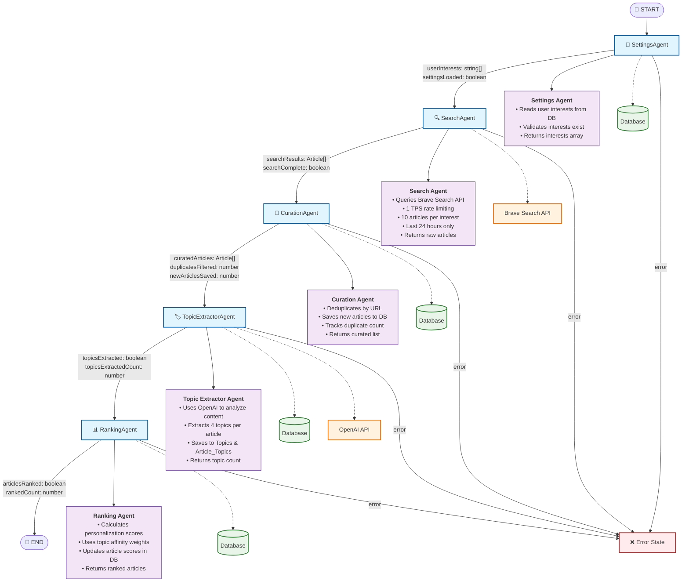

# FlowGenius Architecture Documentation
## P1 Personalization Engine + P2 History & Archiving

*Last Updated: July 1, 2025*

---

## 🏗️ **System Overview**

FlowGenius is an AI-powered Personalized News Curator built with Electron, React, TypeScript, LangGraph, SQLite, and Brave Search API. The system implements a sophisticated agentic architecture that learns from user interactions to deliver increasingly relevant news content.

### **Core Architecture Principles**
- **AI-First Design**: Modular, scalable, and easy to understand
- **Agent-Based Workflow**: LangGraph orchestrates specialized AI agents
- **Learning System**: Continuous improvement through user feedback
- **Historical Archive**: Complete news briefing history with interaction tracking

---

## 🔄 **LangGraph Workflow Architecture**



### **Agent Detailed Specifications**

#### **🔧 1. SettingsAgent**
- **File**: `src/main/services/news_curator/agents/settings.ts`
- **Purpose**: Loads user interests from database
- **Input**: Empty initial state
- **Output**: `userInterests[]`, `settingsLoaded`
- **Database**: Reads from `Interests` table
- **Error Handling**: Returns empty interests array with error flag

#### **🔍 2. SearchAgent**
- **File**: `src/main/services/news_curator/agents/search.ts`
- **Purpose**: Fetches news articles from Brave Search API
- **Input**: User interests array
- **Output**: `searchResults[]`, `searchComplete`
- **External API**: Brave Search News API
- **Rate Limiting**: 1 TPS (1000ms delay between requests)
- **Parameters**: 10 articles per interest, last 24 hours, English, US region
- **Error Handling**: Continues with partial results if some searches fail

#### **📝 3. CurationAgent**
- **File**: `src/main/services/news_curator/agents/curation.ts`
- **Purpose**: Deduplicates and saves new articles to database
- **Input**: Raw search results array
- **Output**: `curatedArticles[]`, `duplicatesFiltered`, `newArticlesSaved`
- **Database**: Writes to `Articles` table, checks URL duplicates
- **Logic**: SQL-based deduplication, batch insert operations
- **Performance**: Tracks before/after counts for verification

#### **🏷️ 4. TopicExtractorAgent**
- **File**: `src/main/services/news_curator/agents/topic_extractor.ts`
- **Purpose**: AI-powered topic extraction and categorization
- **Input**: Curated articles array
- **Output**: `topicsExtracted`, `topicsExtractedCount`
- **External API**: OpenAI GPT-4 for content analysis
- **Logic**: Extracts 4 topics per article, creates topic relationships
- **Database**: Writes to `Topics` and `Article_Topics` tables
- **Performance**: Processes articles individually with error resilience

#### **📊 5. RankingAgent**
- **File**: `src/main/services/news_curator/agents/ranking.ts`
- **Purpose**: Personalizes article order using learned topic affinities
- **Input**: Articles with extracted topics
- **Output**: `articlesRanked`, `rankedCount`
- **Database**: Reads `TopicAffinities`, updates `Articles.personalization_score`
- **Algorithm**: Weighted average of topic affinity scores
- **Personalization**: Adapts to user preferences over time

---

## 🗄️ **Database Schema**

### **Core Tables**

```sql
-- User Interests Management
CREATE TABLE Interests (
  id INTEGER PRIMARY KEY AUTOINCREMENT,
  name TEXT NOT NULL UNIQUE,
  created_at TIMESTAMP DEFAULT CURRENT_TIMESTAMP
);

-- News Articles Storage
CREATE TABLE Articles (
  id INTEGER PRIMARY KEY AUTOINCREMENT,
  url TEXT NOT NULL UNIQUE,
  title TEXT NOT NULL,
  description TEXT,
  source TEXT,
  published_at TIMESTAMP,
  thumbnail_url TEXT,
  fetched_at TIMESTAMP DEFAULT CURRENT_TIMESTAMP,
  personalization_score REAL DEFAULT 0.0
);

-- Topic Categories
CREATE TABLE Topics (
  id INTEGER PRIMARY KEY AUTOINCREMENT,
  name TEXT NOT NULL UNIQUE,
  created_at TIMESTAMP DEFAULT CURRENT_TIMESTAMP
);

-- Article-Topic Relationships
CREATE TABLE Article_Topics (
  id INTEGER PRIMARY KEY AUTOINCREMENT,
  article_id INTEGER NOT NULL,
  topic_id INTEGER NOT NULL,
  relevance_score REAL DEFAULT 1.0,
  created_at TIMESTAMP DEFAULT CURRENT_TIMESTAMP,
  FOREIGN KEY (article_id) REFERENCES Articles (id) ON DELETE CASCADE,
  FOREIGN KEY (topic_id) REFERENCES Topics (id) ON DELETE CASCADE,
  UNIQUE(article_id, topic_id)
);

-- User Topic Preferences (P1 Personalization)
CREATE TABLE TopicAffinities (
  id INTEGER PRIMARY KEY AUTOINCREMENT,
  topic_id INTEGER NOT NULL,
  affinity_score REAL DEFAULT 0.0,
  interaction_count INTEGER DEFAULT 0,
  last_updated TIMESTAMP DEFAULT CURRENT_TIMESTAMP,
  FOREIGN KEY (topic_id) REFERENCES Topics (id) ON DELETE CASCADE,
  UNIQUE(topic_id)
);

-- User Interactions Tracking (P1 Personalization)
CREATE TABLE Interactions (
  id INTEGER PRIMARY KEY AUTOINCREMENT,
  article_id INTEGER NOT NULL,
  interaction_type TEXT NOT NULL CHECK (interaction_type IN ('click', 'like', 'dislike')),
  created_at TIMESTAMP DEFAULT CURRENT_TIMESTAMP,
  FOREIGN KEY (article_id) REFERENCES Articles (id) ON DELETE CASCADE
);

-- Workflow Execution Statistics
CREATE TABLE WorkflowRuns (
  id INTEGER PRIMARY KEY AUTOINCREMENT,
  interests_count INTEGER DEFAULT 0,
  search_results_count INTEGER DEFAULT 0,
  curated_articles_count INTEGER DEFAULT 0,
  duplicates_filtered_count INTEGER DEFAULT 0,
  new_articles_saved_count INTEGER DEFAULT 0,
  topics_extracted_count INTEGER DEFAULT 0,
  articles_ranked_count INTEGER DEFAULT 0,
  status TEXT DEFAULT 'completed' CHECK (status IN ('running', 'completed', 'failed')),
  error_message TEXT,
  started_at TIMESTAMP DEFAULT CURRENT_TIMESTAMP,
  completed_at TIMESTAMP,
  duration_ms INTEGER
);

-- Historical Briefings Archive (P2 History & Archiving)
CREATE TABLE Briefings (
  id INTEGER PRIMARY KEY AUTOINCREMENT,
  title TEXT NOT NULL,
  summary TEXT,
  created_at TIMESTAMP DEFAULT CURRENT_TIMESTAMP
);

-- Briefing-Article Relationships (P2 History & Archiving)
CREATE TABLE Briefing_Articles (
  id INTEGER PRIMARY KEY AUTOINCREMENT,
  briefing_id INTEGER NOT NULL,
  article_id INTEGER NOT NULL,
  created_at TIMESTAMP DEFAULT CURRENT_TIMESTAMP,
  FOREIGN KEY (briefing_id) REFERENCES Briefings (id) ON DELETE CASCADE,
  FOREIGN KEY (article_id) REFERENCES Articles (id) ON DELETE CASCADE
);
```

---

## 🎯 **P1 Personalization Engine**

### **Learning Algorithm**
The personalization system uses a **topic affinity scoring** approach:

1. **Topic Extraction**: AI identifies 4 topics per article
2. **Interaction Tracking**: User actions (like/dislike/click) are recorded
3. **Affinity Updates**: Topic scores are adjusted based on interactions
4. **Article Ranking**: Future articles are scored using topic affinity weights

### **Affinity Score Calculation**
```typescript
// Like: +0.1 to topic affinity
// Dislike: -0.1 to topic affinity  
// Click: +0.05 to topic affinity

const newScore = currentScore + interactionWeight;
```

### **Personalization Components**

#### **AffinityAgent** (`src/main/services/news_curator/agents/affinity.ts`)
- Processes user interactions in real-time
- Updates topic affinity scores in database
- Handles multiple topics per article interaction
- Maintains interaction count statistics

#### **Analytics Dashboard** (`src/renderer/screens/dashboard.tsx`)
- Displays topic affinities with visual bars
- Shows interaction statistics (likes, dislikes, clicks)
- Provides workflow run history and performance metrics
- Real-time updates of user preferences

---

## 📚 **P2 History & Archiving**

### **Automatic Briefing Creation**
Every successful workflow run creates a dated briefing:

```typescript
const briefingTitle = new Date().toLocaleDateString('en-US', {
  year: 'numeric',
  month: 'long', 
  day: 'numeric'
}); // e.g., "July 1, 2025"
```

### **History Architecture**

#### **Backend Archiving** (`src/main/index.ts`)
- **Automatic**: Briefings created after each successful workflow
- **Linking**: Articles associated with briefings via junction table
- **Metadata**: Briefing titles, creation dates, article counts

#### **History Sidebar** (`src/renderer/components/HistorySidebar.tsx`)
- **Collapsible**: Open by default, toggleable via hamburger menu
- **Chronological**: Most recent briefings first
- **Smart Dates**: "Today", "Yesterday", relative time display
- **Article Counts**: Shows number of articles per briefing
- **Click Navigation**: Load historical articles on briefing selection

#### **Interaction State Persistence**
- **Cross-Session**: Like/dislike states preserved across app restarts
- **Cross-Navigation**: States maintained when switching tabs/briefings
- **Real-Time Loading**: Interaction states loaded automatically
- **Visual Consistency**: Liked articles stay green, disliked stay red

---

## 🖥️ **Frontend Architecture**

### **Component Hierarchy**
```
MainApp (State Management)
├── Navigation (Tab Switching)
├── HistorySidebar (P2 History)
│   ├── Briefing List
│   └── Date Formatting
├── MainScreen (News Display)
│   ├── ArticleCard (P1 Interactions)
│   └── InterestsModal
└── DashboardScreen (P1 Analytics)
    ├── Topic Affinities
    ├── Statistics Cards
    └── Interaction Timeline
```

### **State Management**
- **Persistent State**: Articles and interactions maintained across navigation
- **Shared Context**: MainApp manages global state for all screens
- **Real-Time Updates**: Interaction states updated immediately
- **Error Handling**: Graceful degradation with user feedback

### **UI/UX Features**
- **Responsive Design**: Adapts to window sizing
- **Loading States**: Skeleton screens and progress indicators
- **Error Boundaries**: User-friendly error messages
- **Accessibility**: Keyboard navigation and screen reader support

---

## 🔌 **IPC Communication Layer**

### **News Workflow**
- `get-daily-news`: Triggers complete LangGraph workflow
- `handle-interaction`: Records user interactions (like/dislike/click)

### **Settings Management**
- `get-interests`: Retrieves user interests
- `add-interest`: Adds new interest topic
- `delete-interest`: Removes interest topic

### **Analytics & Dashboard**
- `get-dashboard-data`: Fetches comprehensive analytics data
- `get-article-interactions`: Loads interaction states for articles

### **History & Archiving (P2)**
- `get-briefings-list`: Retrieves all historical briefings
- `get-briefing-articles`: Fetches articles for specific briefing

---

## 🚀 **Performance & Scalability**

### **Optimization Strategies**
- **Database Indexing**: Optimized queries for large datasets
- **Batch Operations**: Efficient bulk inserts and updates
- **Caching**: Reuse of topic extractions and affinity calculations
- **Rate Limiting**: Respects external API constraints

### **Monitoring & Observability**
- **Workflow Statistics**: Detailed execution metrics in WorkflowRuns table
- **Error Tracking**: Comprehensive error logging and user feedback
- **Performance Metrics**: Duration tracking for optimization
- **User Analytics**: Interaction patterns and engagement metrics

---

## 🔮 **Future Extensibility**

### **Planned Enhancements**
- **Executive Summary**: AI-generated briefing summaries
- **Audio Briefings**: Text-to-speech integration
- **Deep Dive Agent**: On-demand research capabilities
- **Liked Articles View**: Dedicated collection of favorites

### **Architecture Benefits**
- **Modular Agents**: Easy to add new processing steps
- **Flexible State**: Simple to extend workflow data
- **Plugin System**: Ready for third-party integrations
- **AI-Ready**: Built for future AI model improvements

---

## 📊 **Success Metrics**

### **Technical KPIs**
- **Workflow Success Rate**: >95% successful completions
- **Response Time**: <30s for complete workflow
- **Deduplication Efficiency**: >90% duplicate detection
- **Personalization Accuracy**: Improving like/dislike ratio over time

### **User Experience KPIs**
- **Engagement**: Daily active usage patterns
- **Satisfaction**: Like-to-dislike ratio trends
- **Retention**: Multi-day usage consistency
- **Discovery**: New topic exploration rates

---

*This architecture documentation represents the current state of FlowGenius P1 + P2 implementation, providing a comprehensive foundation for future development and team onboarding.* 